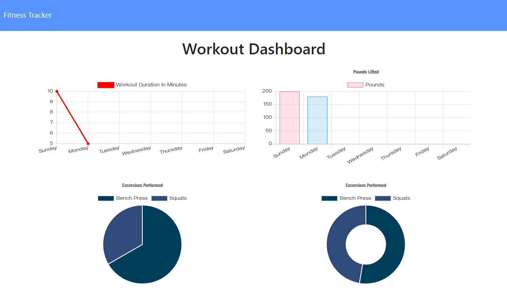

# Workout Tracker

---

### Table of Contents

- [Description](#description)
- [How to Use](#how-to-use)
- [Installation](#installation)
- [Technologies](#technologies)
- [License](#license)
- [Contributors](#contributors)

---

### Description

Workout Tracker is an application to track the specific details of your workout exercises, like duration, distance, reps, weight, and more. Keep track of your progress over time with detailed charts to display the data.

---

### How to Use

Simply open the application in your browser to start keeping track of your workouts.

---

### Installation

Workout Tracker is live [here](https://shiftymitch-workout-tracker.herokuapp.com/)

---

### Technologies

[Express](https://expressjs.com/)\
[Mongoose](https://mongoosejs.com/)\
[Node.js](https://nodejs.org/en/)\

---

### License

MIT © [shiftymitch](https://github.com/shiftymitch)

---

### Contributors

| Developer | GitHub |
| ------ | ------ |
| Mitch Henderson | [shiftymitch](https://github.com/shiftymitch) |

[Back to the Top](#project-name)
